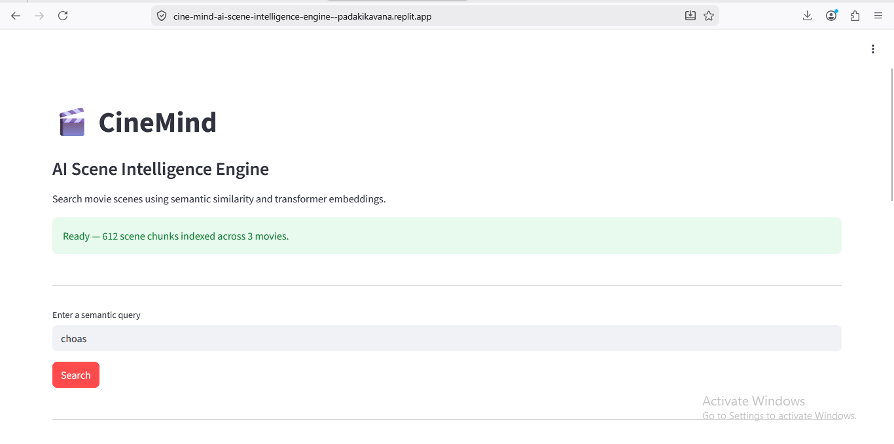
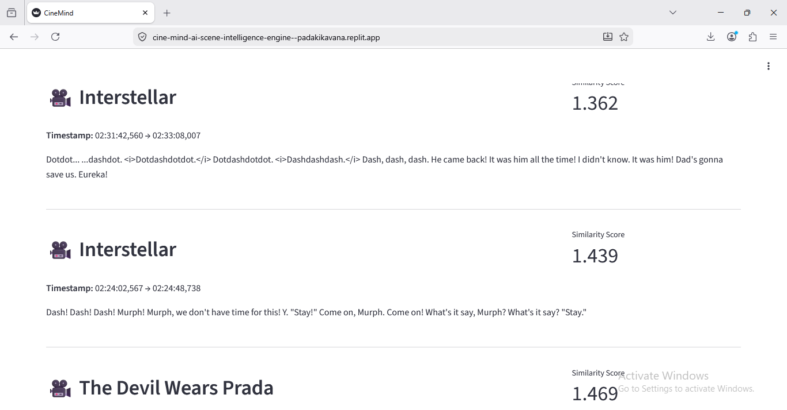
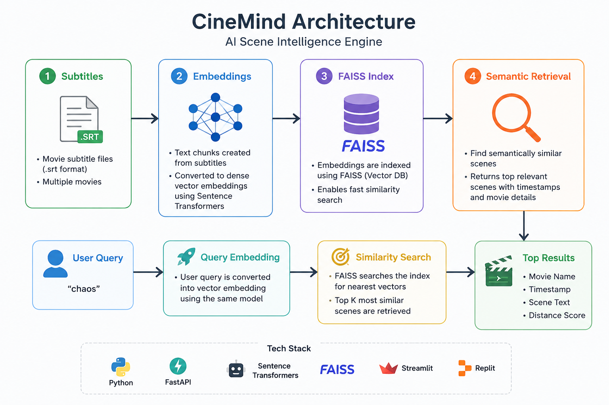

# 🎬 CineMind — AI Scene Intelligence Engine

CineMind is a semantic scene retrieval system that enables contextual search across movie subtitles using transformer embeddings and vector similarity search.

Instead of keyword matching, CineMind retrieves scenes based on semantic meaning, emotional tone, and contextual similarity.

## Live Demo

- [**Live Demo (UI)**](https://cine-mind-ai-scene-intelligence-engine--padakikavana.replit.app)
  
## HOME
 

## Semantic Retrieval Results



## Architecture


---

# Features

- Semantic scene retrieval using transformer embeddings
- Multi-movie subtitle indexing
- FAISS-powered vector similarity search
- Context-aware chunking pipeline
- FastAPI backend for retrieval APIs
- Streamlit UI for interactive querying
- Real-time semantic search across movie dialogues

---

#  How It Works

```text
Movie Subtitles (.srt)
        ↓
Subtitle Parsing
        ↓
Scene Chunking
        ↓
Transformer Embeddings
        ↓
FAISS Vector Index
        ↓
Semantic Retrieval
        ↓
Relevant Scene Results
```

---

# 🛠️ Tech Stack

- Python
- FastAPI
- Streamlit
- SentenceTransformers
- FAISS
- PySRT
- NumPy

---

# 📂 Project Structure

```text
cinemind/
│
├── app.py
├── parser.py
├── retrieval.py
├── streamlit_app.py
├── requirements.txt
├── .gitignore
│
├── data/
│   ├── dark_knight.srt
│   ├── Interstellar.srt
│   └── Devil_Wears_Prada_2.srt
│
└── vector_store/
```

---

# 🔍 Example Queries

```text
chaos
fear and panic
emotional conflict
hope and sacrifice
career pressure
madness
```

---

# 📊 Example Retrieval Output

```json
{
  "movie": "The Dark Knight",
  "timestamp": "01:50:24 → 01:51:14",
  "scene": "Introduce a little anarchy... And everything becomes chaos.",
  "score": 0.922
}
```

---

# 🧠 Key Engineering Concepts

## Semantic Retrieval

CineMind uses transformer embeddings instead of keyword matching, enabling retrieval based on contextual meaning and emotional similarity.

---

## Scene-Aware Chunking

Instead of arbitrary text splitting, subtitle entries are grouped into scene-level contextual chunks for improved retrieval quality.

---

## Vector Similarity Search

FAISS enables efficient nearest-neighbor search over high-dimensional embeddings for scalable semantic retrieval.

---

# ⚠️ Challenges Solved

- FAISS index synchronization issues
- Subtitle text cleaning and formatting
- Embedding lifecycle management
- Chunk-size tuning for retrieval quality
- Semantic retrieval debugging

---

# 🔮 Future Improvements

- Persistent vector storage
- Hybrid search (keyword + semantic)
- Cross-encoder reranking
- LLM-generated scene summaries
- Multimodal video embeddings
- Character-level filtering

---

# 👤 Author

Kavana Padaki
